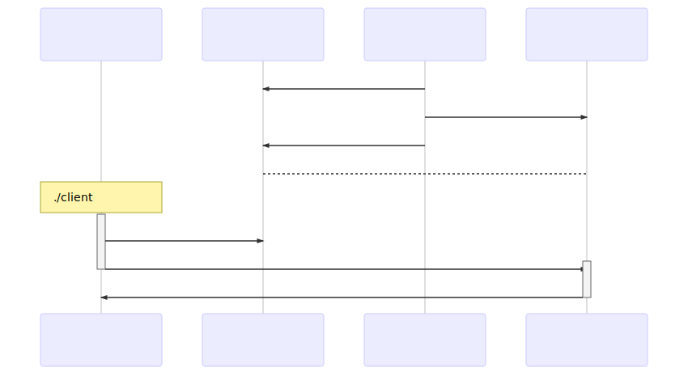

[Previous](.././40_knock_knock/) | [Next](.././A0_return_sizes/)

# Hello, World!
*Send a message through a door to another process*

In this lesson, we demonstrate how to pass a string through a door into the
server process, and return a string back to the client. These being polite
programs, they will exchange pleasantries:

> client: "Hello, World!"

> server: "Well hello yourself!"



Because we are both sending and receiving data, we will need to prepare room
in [client.c](client.c) for two strings: the `greeting` we want to send and
the `response` we expect to receive.

What we provide to the doors library is not this data, but rather the
addresses and lengths of these two strings (or, in the case of the response,
the maximum length we expect from the server). The structure that holds these
addresses and lengths is a `door_arg_t` and it looks like this:

```c
// from DOOR_CALL(3C) in the illumos manual
typedef struct {
        char            *data_ptr;      /* Argument/result data */
        size_t          data_size;      /* Argument/result data size */
        door_desc_t     *desc_ptr;      /* Argument/result descriptors */
        uint_t          desc_num;       /* Argument/result num descriptors */
        char            *rbuf;          /* Result area */
        size_t          rsize;          /* Result size */
} door_arg_t;
```

At the moment we care about `data_ptr`, `data_size`, `rbuf`, and `rsize`. We
will discuss the descriptor fields later.

The address of our greeting will go in `data_ptr`, and its length will go in
`data_size`. Why they used a separate naming convention for the return values
is beyond me, but they did: the address where we want the response written
goes in `rbuf` and the maximum number of bytes we are willing to accept goes
in `rsize`.

Once we have this struct configured, we pass it to the doors library like so:

```c
door_call(door, &args);
```

Take it for a spin with `make test` and let's see what comes out!

## Check for Understanding
1. What's with the funny output after the server's response?
